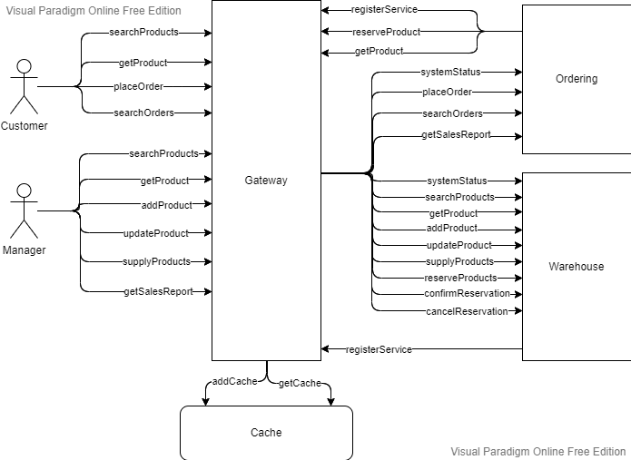

# Lab 1: Web Proxy
This branch contains laboratory 1.
For other laboratories, please see the corresponding branch:
1. Lab1 -> branch "lab1"
2. Lab2 -> branch "lab2"

----------------------------------------------------
## Index
* [System funnctionality](#system-funnctionality)
* [System architecture](#system-architecture)
  * [Warehouse microservice](#warehouse-microservice)

----------------------------------------------------

## System funnctionality
This is the implementation of a simple e-commerce system which will handle the ordering and warehouse operations.

There are 2 types of possible users of the system, each having a list of operations that they can perform:

1. Manager - This is the manager (or employee) of the e-commerce. He can perform the following operations:    

	a. searchProducts - search for the existing products    
	b. getProduct - get the complete information about one product    
	c. addProduct - add the definition of a new product    
	d. updateProduct - update the definition of an existing product    
	e. supplyProducts - supply products to the warehouse (add quantities of products)    
	f. getSalesReport - get information about what quantities of which products have been sold, for which price and the total sales amount	   

2. Customer - This is the customer of the e-commerce. He can perform the following operations:    

	a. searchProducts - search for the existing products    
	b. getProduct - get the complete information about one product    
	c. placeOrder - place a purcase order    
	d. searchOrders - search the orders placed earlier    
	
## System architecture
Our e-commerce system will consyst of 2 microservices: 
1. Warehouse - which will be used to handle the information of the products and available quantities.
2. Ordering - which will be used to perform the sales and create the sales report

Since we expect a big load on our e-commerce system, we will need to have multiple instances of each microservice.

In order to do the load-balancing between these instances we will implement a Gateway.

To further reduce the load on the microservices, we will implement a Cache which will store for a short period of time the responses for the "GET" requests.

Here is a diagram depicting the high-level interaction between the components of our e-commerce system:


Here is the sequence diagram depicting the basic flow of a shopping session.


### Warehouse microservice
This microservice will handle all the warehouse-related operations.

#### The following technologies will be used:
1. Programming language: Java 11
2. Frameworks: Spring Boot, Spring Web, JPA
3. Database: MySql
4. Protocol: HTTP, REST APIs

#### The REST APIs
The Path of all the REST APIs of this microservice will start with /warehouse
This microservice will expose the following REST APIs:

1. searchProducts: search for the existing products
	- Method: GET  
	- Path: /warehouse/products/  
	- Parameters:  

|Name           |Location         | Type             | Description                                       |
|---------------|-----------------|------------------|---------------------------------------------------|
| category      | query           | URL-encoded text | The API will return only the products from the specified category                                        |
| text          | query           | URL-encoded text | The API will return only the products that have the specified text either in name or in description      |
| priceMin      | query           | number           | The API will return only the products whose price is higher than or equal to the specified value         |
| priceMax      | query           | number           | The API will return only the products whose price is lower that or equal to the specified value          |

	- Successful result:
		* Status Code: 200
		* Content Type: application/json
		* Body: JSON object containing a list of products matching the search criteria. Each product in the list will contain the following properties: 
		id, name, category, price, quantity

	- Example request:
	```
	GET http://localhost:8080/warehouse/products?category=electronics&text=Samsung&priceMax=200
	```
	
2. getProduct: get the complete information about one product
	- Method: GET  
	- Path: /warehouse/products/{id}  
	- Parameters:  

|Name           |Location         | Type             | Description                                       |
|---------------|-----------------|------------------|---------------------------------------------------|
| id            | path            | number           | The ID of the product to be retrieved             |

	- Successful result:
		* Status Code: 200
		* Content Type: application/json
		* Body: JSON object containing the following properties: id, name, category, price, quantitydescription, characteristics, version

	- Example request:
	```
	GET http://localhost:8080/warehouse/products/1/
	```

3. addProduct: add the definition of a new product
	- Method: POST  
	- Path: /warehouse/products/  
	- Body: JSON object containing all the information about a product definition: name, category, price, quantitydescription, characteristics    
	- Successful result:
		* Status Code: 200
		* Content Type: application/json
		* Body: JSON object containing the following properties: id, name, category, price, quantitydescription, characteristics, version

	- Example request:
	```
	POST http://localhost:8080/warehouse/products/
	Body:
	{
		"name": "Samsung A51",
		"description": "Dual SIM, 128GB/4GB",
		"category": "electronics",
		"price": "300.00",
		"characteristics": "ROM: 128GB; RAM: 4GB; OS: Android 10.0; Dimentions: 0.7 x 7.3 x 15.8 cm; 172 Grams",
		"photo": "data:image/jpeg;base64,/9j/4AAQSkZJRgABAQAAAQABAAD/...NgYx3UAeYSByyEwTBMEwf+L//Z"
	}	
	```

4. updateProduct: update the definition of an existing product
	- Method: PUT  
	- Path: /warehouse/products/  
	- Body: JSON object containing all the information about a product definition: name, category, price, quantitydescription, characteristics    
	- Successful result:
		* Status Code: 200
		* Content Type: application/json
		* Body: JSON object containing the following properties: id, name, category, price, quantitydescription, characteristics, version

	- Example request:
	```
	PUT http://localhost:8080/warehouse/products/
	Body:
	{
		"id": "52",
		"name": "Samsung A51",
		"description": "Dual SIM, 128GB/4GB",
		"category": "electronics",
		"price": "259.99",
		"characteristics": "ROM: 128GB; RAM: 4GB; OS: Android 10.0; Dimentions: 0.7 x 7.3 x 15.8 cm; 172 Grams",
		"photo": "data:image/jpeg;base64,/9j/4AAQSkZJRgABAQAAAQABAAD/...NgYx3UAeYSByyEwTBMEwf+L//Z",
		"version": "0"
	}	
	```

5. supplyProducts - supply products to the warehouse (add quantities of products)
	- Method: POST  
	- Path: /warehouse/supply/  
	- Body: JSON object containing all the information about the supply: date-time, list of product IDs and quantities.    
	- Successful result:
		* Status Code: 200
		* Content Type: application/json

	- Example request:
	```
	POST http://localhost:8080/warehouse/supply/
	Body:
	{
		"number": "241",
		"date": "2022-01-21T10:05:12",
		"confirmed": "true",
		"inputOutputs": [
			{
				"product": "52",
				"quantity": "20"
			},
			{
				"product": "2",
				"quantity": "4"
			}
		]
	}
	```
6. reserveProducts - reserve quantities of products
	- Method: POST  
	- Path: /warehouse/reservation/  
	- Body: JSON object containing all the information about the reservation: date-time, list of product IDs and quantities.    
	- Successful result:
		* Status Code: 200
		* Content Type: application/json
		* Body: reservationId as text

	- Example request:
	```
	POST http://localhost:8080/warehouse/reservation/
	Body:
	{
		"number": "100027515",
		"date": "2022-01-21T14:50:45",
		"confirmed": "false",
		"inputOutputs": [
			{
				"product": "52",
				"quantity": "1"
			},
			{
				"product": "2",
				"quantity": "1"
			}
		]
	}
	```
6. confirmReservation - confirm reserved quantities of products
	- Method: PUT  
	- Path: /warehouse/reservation/{reservationId}/confirm  
	- Body: JSON object containing a single property: reservationId    
	- Successful result:
		* Status Code: 200
		* Content Type: application/json

	- Example request:
	```
	PUT http://localhost:8080/warehouse/reservation/5434/confirm
	```
7. cancelReservation - calcel reserved quantities of products
	- Method: PUT  
	- Path: /warehouse/reservation/{reservationId}/cancel  
	- Body: JSON object containing a single property: reservationId    
	- Successful result:
		* Status Code: 200

	- Example request:
	```
	PUT http://localhost:8080/warehouse/reservation/5434/cancel
	```
8. consolidateQuantities - recalculate quantities for all the operations that happened before the specified date.
	- Method: PUT  
	- Path: /warehouse/consolidate  

|Name           |Location         | Type             | Description                                       |
|---------------|-----------------|------------------|---------------------------------------------------|
| date          | query           | date             | The date for consolidation                        |

	- Successful result:
		* Status Code: 200

9. status: get the system status. This API should be called by the gateway to determine if the system is UP.
	- Method: GET  
	- Path: /warehouse/status/  
	- Successful result:
		* Status Code: 200

### Ordering microservice
This microservice will handle all the operations related to odering of products.

#### The following technologies will be used:
1. Programming language: Java 11
2. Frameworks: Spring Boot, Spring Web, Spring Data Couchbase, Spring Data Repositories
3. Database: Couchbase (NoSQL)
4. Protocol: HTTP, REST APIs

#### The REST APIs
The Path of all the REST APIs of this microservice will start with /ordering
This microservice will expose the following REST APIs:

1. placeOrder: place a purcase order
	- Method: POST  
	- Path: /ordering/orders/  
	- Body: a JSON object containing all the information about the purchase order: customer info, shipping address, list of product informations (product ID, quantity , price).  

	- Successful result:
		* Status Code: 200
		* Content Type: application/json
		* Body: JSON object containing all the information about the purchase order: order ID, order date-time, customer info, shipping address, list of product informations (product ID, quantity , price).

	- Example request:
	```
	POST http://localhost:8080/ordering/orders/
	Body:
	{
        "id": "4321",
        "user": "user1",
        "custName": "Alina Dubenco",
        "address": "Alba Iulia, 41",
        "city": "Chisinau",
        "details": [
            {
                "productId": "1",
                "price": "120.50",
                "quantity": "1"
            },
            {
                "productId": "2",
                "price": "10.99",
                "quantity": "2"
            }
        ]
	}		
	```

2. searchOrders: search for the existing purchase orders
	- Method: GET  
	- Path: /ordering/orders/  
	- Parameters:  

|Name           |Location         | Type             | Description                                                                     |
|---------------|-----------------|------------------|---------------------------------------------------------------------------------|
| user          | query           | URL-encoded text | The API will return only the orders for the specified user                      |
| fromDate      | query           | number           | The API will return only the object placed after the specified date (inclusive) |
| toDate        | query           | number           | The API will return only the object placed before the specified date (inclusive)|

	- Successful result:
		* Status Code: 200
		* Content Type: application/json
		* Body: JSON object containing a list of purchase orders matching the search criteria. Each product in the list will contain the following properties: 
		id, date, product, price, quantity

3. getSalesReport: get information about what quantities of which products have been sold, for which price and the total sales amount
	- Method: GET  
	- Path: /ordering/sales/  
	- Parameters:  

|Name           |Location         | Type             | Description                                                                                             |
|---------------|-----------------|------------------|---------------------------------------------------------------------------------------------------------|
| fromDate      | query           | number           | The API will include in the report only the purchase orders placed after the specified date (inclusive) |
| toDate        | query           | number           | The API will include in the report only the purchase orders placed before the specified date (inclusive)|

	- Successful result:
		* Status Code: 200
		* Content Type: application/json
		* Body: JSON object containing information about the sales

4. status: get the system status. This API should be called by the gateway to determine if the system is UP.
	- Method: GET  
	- Path: /warehouse/status/  
	- Successful result:
		* Status Code: 200


### Gateway
Gateway will handle the forwarding of all the REST API requests to microservices. 
It will also do load-balancing.
In addition, the Gateway will decide what should be cached and will return the cached result if that is available (without calling the microservices).

All the communications in our e-commerce system will go through the Gateway:
- clients will send the requests to Gateway    
- when a microservice needs to call a REST API from another microservice, it will send the request to Gateway  
- the Gateway will decide which microservice and which instance of that microservice should process the request
- the Gateway will forward the requests to the correct microservice instance
- when the Gateway gets the response from the microservice, it will forward the response to the client that has called the API

The communication with the Cache server will be done via TCP/IP using a custom-defined protocol (see below the section about the Cache).    
In order to enable multiple threads to call Cache server in parallel, a pool of CacheClients will be maintained.    
Whenever a thread needs to communicate with the Cache server, it will borrow a CacheClient from the pool, will communicate with the Cache server and then will return the CacheClient to the pool.    
Each CacheClient in the pool will keep the connection to the Cache server open (Keep-Alive Connection).  

#### The following technologies will be used:
1. Programming language: Java 11
2. Frameworks: Spring Boot, Servlet, Java 11 standard HTTP Client API, Socket, Apache Commons Pool
3. Protocol: HTTP, TCP/IP

#### The REST APIs
The Path of all the REST APIs of this microservice will start with /ordering
This microservice will expose the following REST APIs:

1. registerService: register a mincroservices instance. This API should be called by every microservice instance when it comes up.
	- Method: POST  
	- Path: /gateway/services/  
	- Body: a Text containing 2 lines: 1st line - microservice type, 2nd line - microservice base URL.  
	- Successful result:
		* Status Code: 200
	- Example:
	```
	POST http://localhost:8080/gateway/services/
	Body:
	ordering
	http://localhost:8081/
	```


### Cache
The Cache will be used to store for a pre-defined period of time responses to "GET" requests.    

The Cache server will listen for client connection on the port specified using the "-Dserver.port" command option. Default value is 8081.
Once a client connects, a new Socket is open and all the communication with that client will happen via that Socket in a separate thread.
The number of threads is configurable via "-Dmax.threads" command option. Default value is 10.    
The responces will be held in Cache for at least the duration specified by "-Dexpiry.duration.seconds" command option. Default value is 120 (2 minutes).

#### The following technologies will be used:
1. Programming language: Java 11
2. Frameworks: ServerSocket, Google Guava Cache (https://github.com/google/guava/wiki/CachesExplained)
4. Protocol: TCP/IP, Custom application protocol 

#### Custom Application Protocol
The client can send the following commands:

1. -=|{ADD_CACHE}|=-: add the response for a URL to the Cache    
The "-=|{ADD_CACHE}|=-" command has to be sent alone in one line.    
It must be followed by the URL as the next line.    
After this the value that needs to be added to cache has to be sent. It can contain multiple lines.    
The value must be followed by the "-=|{END}|=-" text in a separate line.
If the cache has been added successfully, the Cache application will respond with the text "-=|{ADD_SUCCESS}|=-" in a separate line.

Here is an example of communication between the client and the Cache server:
```
CLIENT>-=|{ADD_CACHE}|=-
CLIENT>/warehouse/products/85
CLIENT>-=|{HEADERS}|=-
CLIENT>Content-Type||||application/json;charset=ISO-8859-1
CLIENT>Content-Length||||492
CLIENT>-=|{BODY}|=-
CLIENT>{
CLIENT>    "id": 85,
CLIENT>    "name": "Samsung Galaxy S20",
CLIENT>    "description": "Samsung Galaxy S20 FE G780F 256GB Dual Sim GSM Unlocked Android Smart Phone - International Version (White)",
CLIENT>    "category": "electronics",
CLIENT>    "price": 729.00,
CLIENT>    "characteristics": "Display: 6.5 inches Super AMOLED capacitive touchscreen w/ Corning Gorilla Glass 3, Resolution: 1080 x 2400 pixels; Memory: 256GB 8GB RAMMicroSD up to 1TB",
CLIENT>    "photo": "data:image/jpeg;base64,/9j/4AAQSkZJRgABAQAAAQABAAD/...NgYx3UAeYSByyEwTBMEwf+L//Z",
CLIENT>    "version": 0,
CLIENT>    "quantity": 1
CLIENT>}
CLIENT>-=|{END}|=-
SERVER>-=|{ADD_SUCCESS}|=-
``` 

2. -=|{GET_CACHE}|=-: get from cache the response for an URL    
The "-=|{GET_CACHE}|=-" has to be sent alone in one line.    
It must be followed by the URL as the next line.    
If the value for the specified URL is found in Cache, then server will send back the value, followed by the "-=|{END}|=-" text in a separate line.    
If the value for the specified URL is not found in Cache, then the server will respond with "-=|{NOT_FOUND}|=-" text in a separate line.

Here is an example of communication between the client and the Cache server:
```
CLIENT>-=|{ADD_CACHE}|=-
CLIENT>/warehouse/products/85
SERVER>-=|{HEADERS}|=-
SERVER>Content-Type||||application/json;charset=ISO-8859-1
SERVER>Content-Length||||492
SERVER>-=|{BODY}|=-
SERVER>{
SERVER>    "id": 85,
SERVER>    "name": "Samsung Galaxy S20",
SERVER>    "description": "Samsung Galaxy S20 FE G780F 256GB Dual Sim GSM Unlocked Android Smart Phone - International Version (White)",
SERVER>    "category": "electronics",
SERVER>    "price": 729.00,
SERVER>    "characteristics": "Display: 6.5 inches Super AMOLED capacitive touchscreen w/ Corning Gorilla Glass 3, Resolution: 1080 x 2400 pixels; Memory: 256GB 8GB RAMMicroSD up to 1TB",
SERVER>    "photo": "data:image/jpeg;base64,/9j/4AAQSkZJRgABAQAAAQABAAD/...NgYx3UAeYSByyEwTBMEwf+L//Z",
SERVER>    "version": 0,
SERVER>    "quantity": 1
SERVER>}
SERVER>-=|{END}|=-
